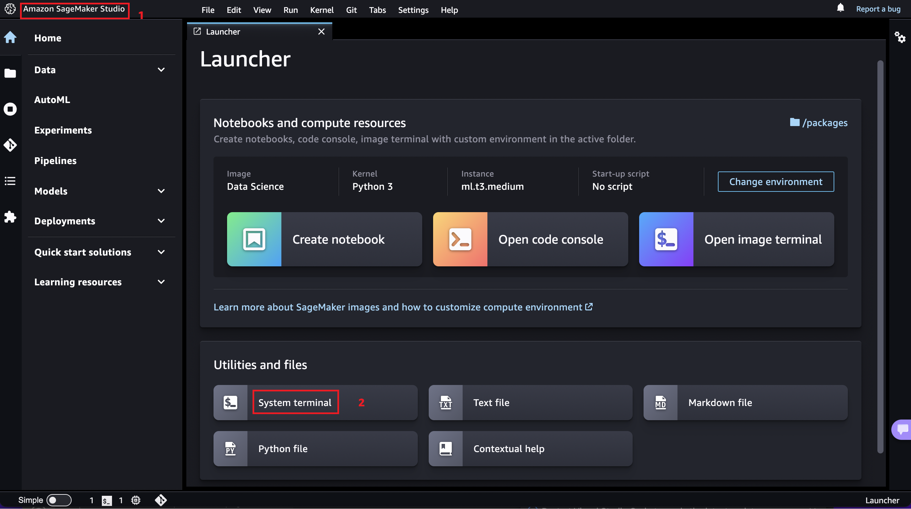

## My Project

This project walks you through how you can deploy a ControleNet model with Stable Diffusion on SageMaker endpoint using Multi-Model approach and Single-model approach. 
* For the multi-model deployment approach please run the ControlNet-MME.ipynb
* For the single mode deployment approach please run the ControlNet.ipynb

## Set Up StreamLit Front-End

The streamlit app for this prioject is located in *app_complete.py*.

To run this Streamlit App on Sagemaker Studio follow the steps in the link below:
* [Set Up SageMaker Studio](https://docs.aws.amazon.com/sagemaker/latest/dg/onboard-quick-start.html)
* [Launch SageMaker Studio](https://docs.aws.amazon.com/sagemaker/latest/dg/studio-launch.html)
* [Clone this git repo into studio](https://docs.aws.amazon.com/sagemaker/latest/dg/studio-tasks-git.html)
* In the app_complete.py script, change the values for the variables `ENDPOINT` to the name of the endpoint hosting the models and `BUCKET` to the name of the bucket to hold the input and output images.
* Open a system terminal by clicking on **Amazon SageMaker Studio** and then **System Terminal** as shown in the diagram below
* 
* Navigate into the cloned repository directory using the `cd` command and run the command `pip install -r requirements.txt` to install the needed python libraries
* Run command `python3 -m streamlit run app_complete.py` to start the Streamlit server. Do not use the links generated by the command as they won't work in studio.
* To enter the Streamlit app, open and run the **Streamlit_app.ipynb** notebook. This will generate the appropiate link to enter your Streamlit app from SageMaker studio. Click on the link to enter your Streamlit app. Happy querying :)
* **⚠ Note:**  If you rerun the Streamlit server it may use a different port. Take not of the port used (port number is the last 4 digit number after the last : (colon)) and modify the `port` variable in the `Streamlit_app.ipynb` notebook to get the correct link.

To run this Streamlit App on AWS EC2 (I tested this on the Ubuntu Image)
* [Create a new ec2 instance](https://docs.aws.amazon.com/AWSEC2/latest/UserGuide/EC2_GetStarted.html)
* Expose TCP port range 8500-9000 on Inbound connections of the attached Security group to the ec2 instance. TCP port 8501 is needed for Streamlit to work. See image below
* 
* [Connect to your ec2 instance](https://docs.aws.amazon.com/AWSEC2/latest/UserGuide/AccessingInstances.html)
* Run the appropiate commands to update the ec2 instance (`sudo apt update` and `sudo apt upgrade` -for Ubuntu)
* Clone this git repo `git clone [github_link]`
* In the app_complete.py script, change the values for the variables `ENDPOINT` to the name of the endpoint hosting the models and `BUCKET` to the name of the bucket to hold the input and output images. Make use of the `nano` command to make this changes. e.g. `nano app_complete.py`
* Install python3 and pip if not already installed
* Install the dependencies in the requirements.txt file by running the command `sudo pip install -r requirements.txt`
* Run command `python3 -m streamlit run app_complete.py` 
* Copy the external link and paste in a new browser tab

## Note
When invoking a model for the first time, it will take some time to load that model from s3 into the endpoint memory before inference happens, subsequent inference on same model will be faster. Also take into consideration compute memory size when deploying a MME. Models are cached in memory for faster inference, however, if memory is full, model(s) would be uncached to make space for the new target model for inference. For more info read [Sagemaker MME](https://docs.aws.amazon.com/sagemaker/latest/dg/multi-model-endpoints.html)

## Security

See [CONTRIBUTING](CONTRIBUTING.md#security-issue-notifications) for more information.

## License

This library is licensed under the MIT-0 License. See the LICENSE file.

